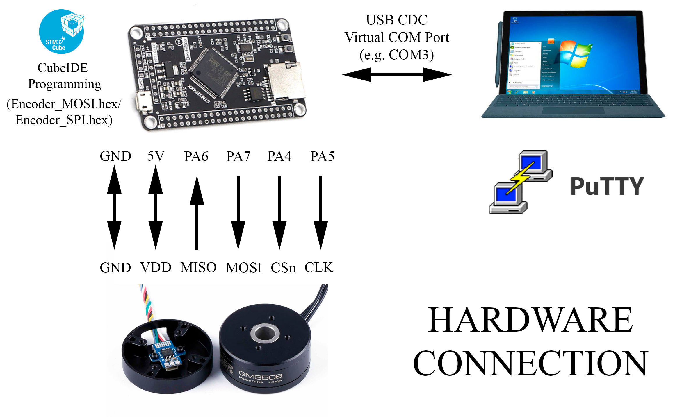

# Encoder-AS5048A-SPI-Programming-with-STM32
This repository is designed to program the encoder AS5048A on motor GM3506 base using the SPI protocol with a STM32 microcontroller

To flash, please follow steps:
1. Download the project folder  [`Encoder_MOSI`](/Encoder_MOSI) or [`Encoder_SPI`](/Encoder_SPI) and open it in the STM32CubeIDE program.
You can also download the [Encoder_MOSI.hex / Encoder_SPI.hex ](https://github.com/fawntio/Encoder-AS5048A-SPI-Programming-with-STM32/releases/tag/first_try) binary file and open it with ST-LINK Utility. Flash firmware to your microcontroller.
2. Connect the pins of the controller and the encoder as shown in the picture:

 Pin Name | Microcontroller Pin# | HM10 Pin# |
| --- | --- | --- | 
| DD (DEBUG_DATA) | PB12 | Pin#8 | 
| DC (DEBUG_CLOCK) | PB10 | Pin#7 | 
| Reset (RESET_N)| PB11 | Pin#11 |
| VCC | 3.3V |  Pin#12 | 
| GND | GND | Pin#13 | 

3. Run the program 
